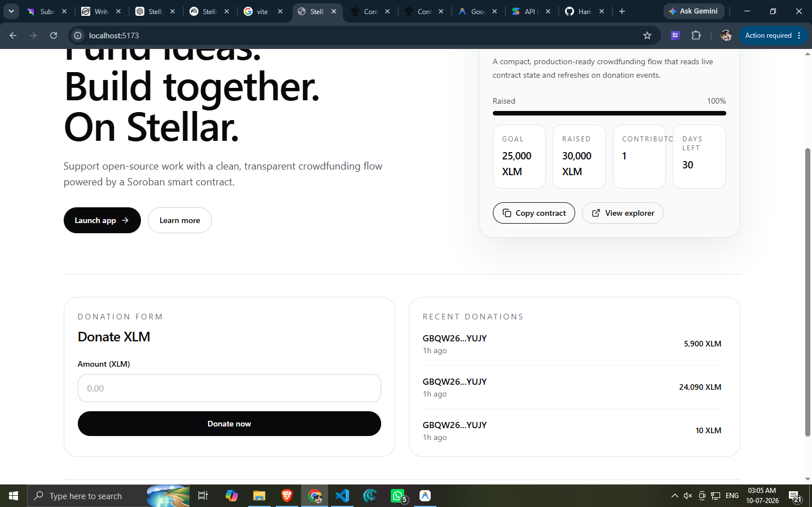
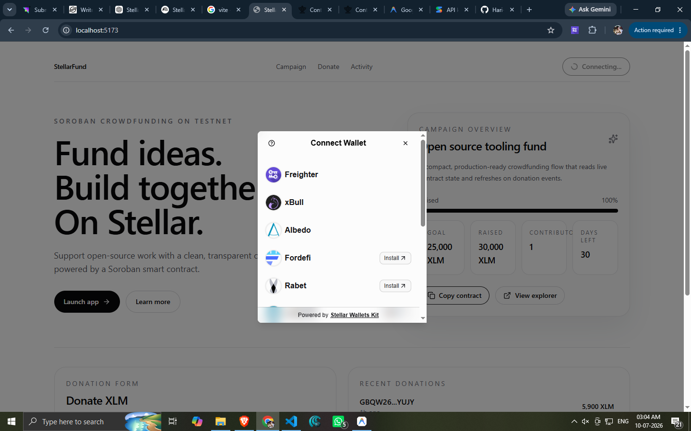
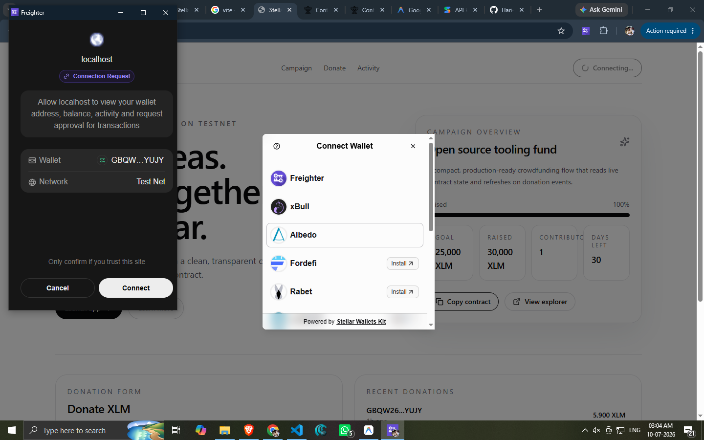
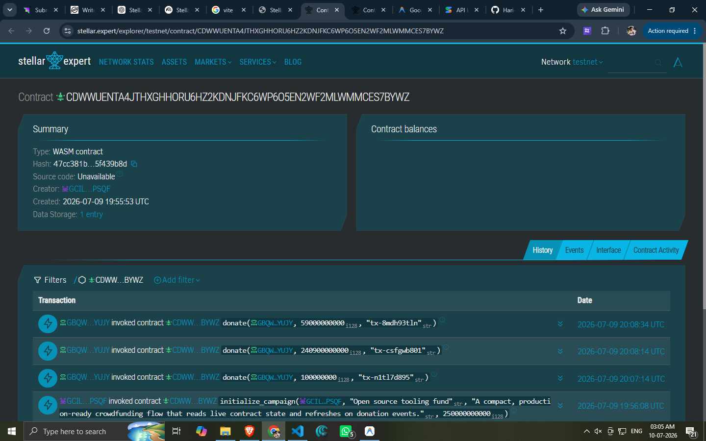

# 🌟 StellarFund

> A decentralized crowdfunding platform powered by **Soroban Smart Contracts** on the **Stellar Network**.

<p align="center">
  
</p>

<p align="center">
  
  
  
  
  
  
  
</p>

---

# 📖 Overview

**StellarFund** is a decentralized crowdfunding platform built on the **Stellar Network** using **Soroban Smart Contracts**.

The platform enables users to securely contribute **XLM** to crowdfunding campaigns while maintaining complete ownership of their wallets. Campaign progress, contributor counts, and recent donations are synchronized directly from the blockchain through contract state and events.

This project was built as part of the **Stellar Developer Belt Program – Yellow Belt (Level 2)** and demonstrates production-ready Stellar development practices including multi-wallet authentication, smart contract interaction, event-driven synchronization, and transaction lifecycle management.

---

# ✨ Features

- 🔐 Multi-wallet authentication with StellarWalletsKit
- 🌍 Supports Freighter, xBull, Albedo, Rabet, Lobstr
- 📄 Soroban Smart Contract deployed on Stellar Testnet
- 💸 Secure XLM crowdfunding donations
- 📊 Live fundraising progress
- 📡 Real-time contract event synchronization
- 🔄 Automatic campaign updates
- 📈 Contributor tracking
- ⏳ Transaction lifecycle (Signing → Pending → Confirmed → Failed)
- 🔗 Stellar Expert transaction explorer integration
- 📋 Copy wallet address
- 📋 Copy transaction hash
- ⚠️ Comprehensive error handling
- 📱 Fully responsive UI
- 🎨 Modern minimal interface inspired by Stellar.org

---

# 🚀 Live Demo

> **Live Application**

[Demo](https://stellar-fundd.netlify.app/)

---

## 🌐 Network

**Stellar Testnet**

---

## 📜 Smart Contract

**Contract ID**

```text
YOUR_CONTRACT_ID
```

**View Contract**

https://stellar.expert/explorer/testnet/contract/CCYJOPGDQSZ2XVR4QCP67RAIFZRVDNXVYT2LRO2U4AJ2XL5D66M3PDYX

---

# 📸 Screenshots

## Campaign & Donation View


---

## Wallet Selection



---

## Wallet Connection Request



---

## Successful Transaction



---

# 🎯 Yellow Belt Requirements Checklist

- [x] StellarWalletsKit Integration
- [x] Multi-wallet Support
- [x] Soroban Smart Contract
- [x] Contract Deployed to Testnet
- [x] Smart Contract Called from Frontend
- [x] Read Contract State
- [x] Write Contract State
- [x] Contract Event Emission
- [x] Real-Time Event Synchronization
- [x] Transaction Status Tracking
- [x] Transaction Hash Display
- [x] Explorer Link
- [x] Error Handling
- [x] Responsive Design
- [x] Public GitHub Repository

---

# 🏗 Architecture

```
                         User
                           │
                           ▼
                   React Frontend
                  (Vercel / Netlify)
                           │
                           ▼
                 StellarWalletsKit
                           │
           ┌───────────────┴───────────────┐
           ▼                               ▼
      Freighter                       xBull Wallet
                           │
                           ▼
                  Sign Transaction
                           │
                           ▼
                  Stellar RPC Server
                           │
                           ▼
               Soroban Smart Contract
                           │
                           ▼
               Stellar Testnet Blockchain
```

---

# ⚙️ Tech Stack

| Category | Technology |
|----------|------------|
| Frontend | React 19 |
| Language | TypeScript |
| Styling | Tailwind CSS |
| Animation | Framer Motion |
| Icons | Lucide React |
| Wallets | StellarWalletsKit |
| Blockchain | Stellar Network |
| Smart Contracts | Soroban SDK |
| Contract Language | Rust |
| Build Tool | Vite |
| Deployment | Vercel |
| Explorer | Stellar Expert |

---

# 📂 Project Structure

```
stellar-fund/
│
├── contracts/
│   └── crowdfunding/
│       ├── src/
│       ├── Cargo.toml
│       └── tests/
│
├── frontend/
│   ├── src/
│   │   ├── components/
│   │   ├── contexts/
│   │   ├── hooks/
│   │   ├── services/
│   │   ├── utils/
│   │   ├── types/
│   │   ├── pages/
│   │   └── App.tsx
│   │
│   ├── public/
│   └── package.json
│
├── screenshots/
│
├── README.md
│
└── LICENSE
```

---

# 🧠 Smart Contract

The crowdfunding contract is written using the **Soroban Rust SDK**.

## Main Functions

| Function | Description |
|----------|-------------|
| `initialize_campaign()` | Creates a crowdfunding campaign |
| `donate()` | Donate XLM |
| `get_campaign()` | Returns campaign details |
| `get_total()` | Returns total funds raised |
| `get_contributors()` | Returns contributor count |
| `get_recent_donations()` | Returns recent donation history |

---

## Contract Storage

Stores:

- Campaign Name
- Description
- Goal
- Raised Amount
- Contributors
- Donation History
- Owner
- Creation Timestamp

---

## Contract Events

The contract emits events for blockchain synchronization.

### DonationReceived

Contains:

- Donor Address
- Donation Amount
- Timestamp
- Transaction Hash

---

# 💼 Wallet Support

**Supported Wallets**

- Freighter
- xBull
- Albedo (if installed)
- Rabet
- Lobstr

**Wallet Features**

- Connect
- Disconnect
- Wallet Address
- Wallet Name
- Copy Address

---

# 💳 Donation Workflow

```
User Connects Wallet
         │
         ▼
Reads Campaign Data
         │
         ▼
Enter Amount
         │
         ▼
Wallet Signature
         │
         ▼
Transaction Submitted
         │
         ▼
Pending Confirmation
         │
         ▼
Contract Executes
         │
         ▼
Donation Event Emitted
         │
         ▼
Frontend Refreshes
```

---

# 🔄 Transaction Lifecycle

```
Idle

↓

Signing Transaction

↓

Submitting

↓

Pending Confirmation

↓

Success

or

↓

Failed
```

**Displayed Information**

- Transaction Hash
- Explorer Link
- Timestamp
- Status

---

# ⚠️ Error Handling

**Implemented**

✅ Wallet Not Installed  
✅ Wallet Rejected  
✅ Insufficient Balance  
✅ Invalid Donation Amount  
✅ RPC Connection Failure  
✅ Contract Execution Failure  
✅ Unknown Errors  

---

# 🛠 Installation

**Clone repository**

```bash
git clone https://github.com/YOUR_USERNAME/stellar-fund.git

cd stellar-fund
```

**Install frontend**

```bash
cd frontend

npm install
```

**Install contract dependencies**

```bash
cd ../contracts/crowdfunding

cargo build
```

---

# 🔧 Environment Variables

Create:

```
frontend/.env
```

```env
VITE_RPC_URL=https://soroban-testnet.stellar.org

VITE_NETWORK=testnet

VITE_NETWORK_PASSPHRASE=Test SDF Network ; September 2015

VITE_CONTRACT_ID=YOUR_CONTRACT_ID
```

---

# ▶ Running Locally

**Frontend**

```bash
npm run dev
```

**Smart Contract**

```bash
cargo test
```

---

# 🚀 Deployment

## Deploy Smart Contract

**Build**

```bash
stellar contract build
```

**Deploy**

```bash
stellar contract deploy \
  --network testnet \
  --source YOUR_ACCOUNT
```

Copy the generated Contract ID into your frontend `.env`.

---

## Deploy Frontend

**Build**

```bash
npm run build
```

**Deploy using**

- Vercel
- Netlify
- Cloudflare Pages

---

# 🧪 Testing

**Run frontend tests**

```bash
npm run test
```

**Run smart contract tests**

```bash
cargo test
```

---

# 🔍 Explorer

**Contract**

https://stellar.expert/explorer/testnet/contract/YOUR_CONTRACT_ID

**Transaction Example**

https://stellar.expert/explorer/testnet/tx/YOUR_TRANSACTION_HASH

---

# 📈 Future Improvements

- Multiple Campaigns
- Campaign Categories
- Campaign Deadlines
- Campaign Images
- Campaign Search
- Campaign Owner Dashboard
- Withdraw Funds
- Donor Leaderboard
- Notifications
- Mainnet Deployment

---

# 🤝 Contributing

Contributions are welcome.

1. Fork the repository

2. Create your feature branch

```bash
git checkout -b feature/my-feature
```

3. Commit your changes

```bash
git commit -m "feat: add new feature"
```

4. Push

```bash
git push origin feature/my-feature
```

5. Open a Pull Request

---

# 👨‍💻 Author

**Hari Gajja**

GitHub: https://github.com/Hari-Gajja

LinkedIn: https://linkedin.com/in/YOUR_LINKEDIN

Portfolio: https://YOUR_PORTFOLIO

---

# 📄 License

This project is licensed under the MIT License.

---

# ❤️ Acknowledgements

- Stellar Development Foundation
- Soroban SDK
- StellarWalletsKit
- React
- Tailwind CSS
- Framer Motion

---

<p align="center">

Built with ❤️ using **Soroban Smart Contracts**, **React**, and the **Stellar Network**.

If you found this project useful, consider giving it a ⭐ on GitHub.

</p>
