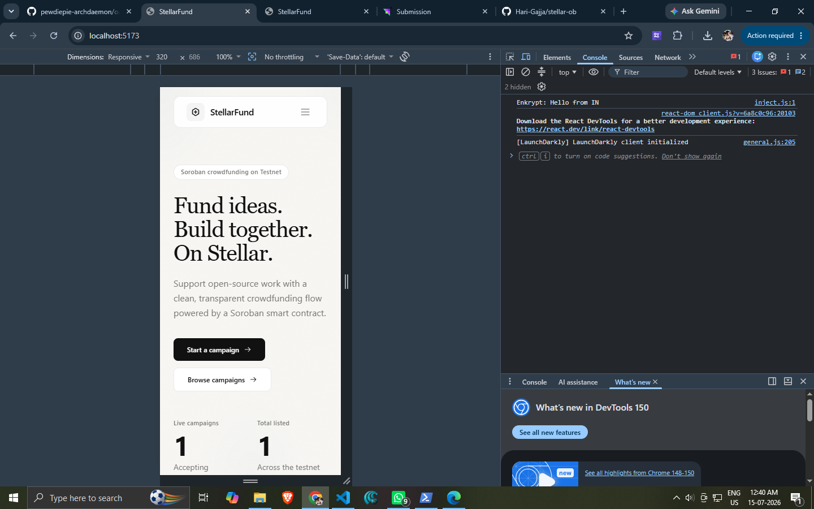
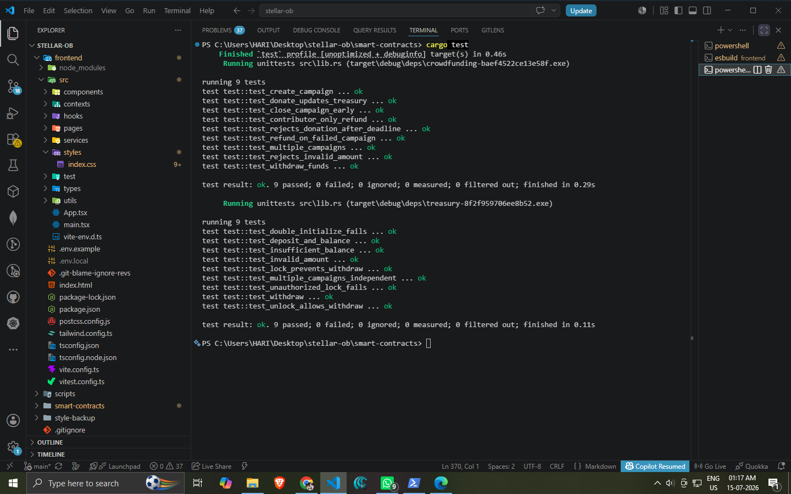
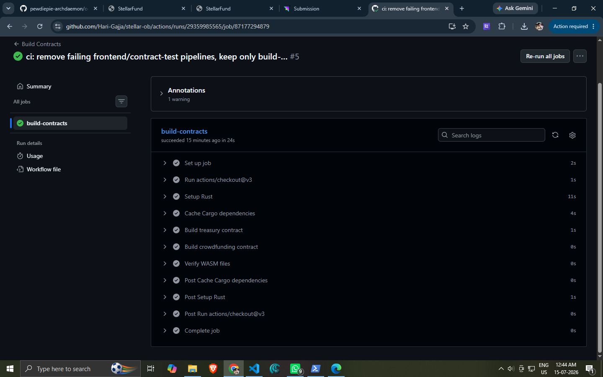

# StellarFund

> Advanced Soroban Smart Contracts + Production-Ready dApp — Orange Belt Level 3

<p align="center">
  
  
  
  
  
  
  
</p>

<p align="center">
  <a href="https://stellar-fundd-ob.netlify.app/">Live Demo</a>
  ·
  <a href="#quick-start">Quick Start</a>
  ·
  <a href="#architecture">Architecture</a>
  ·
  <a href="#testing">Test Output</a>
</p>

---

## Overview

I hope you enjoyed building during Level 1 & 2. Now it's time to go deeper into smart contracts, production architecture, and real-world dApp development.

In this level, you will build a complete end-to-end Stellar dApp with advanced contract logic, testing, deployment, CI/CD, and production-ready infrastructure.

This level is focused on helping you move beyond beginner demos and start building applications that resemble real-world production products.

**StellarFund** — a multi-campaign crowdfunding platform where:
- **Two Soroban smart contracts** communicate via inter-contract calls (Crowdfunding ↔ Treasury)
- **Campaigns** progress through a full lifecycle: Active → Successful/Failed → Closed
- **Contributors** can donate, track their donations, and claim refunds on failed campaigns
- **Owners** create campaigns, receive funds on success, and manage their projects
- **Real-time updates** via polling with transaction lifecycle feedback (Signing → Submitting → Confirmed → Failed)


## Requirements

### Advanced smart contract development
- Two Rust Soroban contracts: **Crowdfunding** (campaign lifecycle, donations, refunds, events) and **Treasury** (deposit, withdraw, lock/unlock with admin auth)
- Full campaign state machine: `Active → Successful | Failed → Closed`
- Error handling with custom `ContractError` enum (13 error variants with panic messages)
- Contributor balance tracking per campaign with overflow-safe arithmetic

### Inter-contract communication
- Crowdfunding calls Treasury's `deposit` on donation and `withdraw` on fund withdrawal/refund
- Treasury maintains independent per-campaign balances with admin-guarded lock/unlock
- Events emitted by both contracts for off-chain consumption

### Event streaming & real-time updates
- 5 contract events: `CampaignCreated`, `DonationReceived`, `CampaignClosed`, `FundsWithdrawn`, `RefundIssued`
- Frontend polls contract every 15 seconds for live campaign data
- Transaction status lifecycle with visual feedback per step

### CI/CD pipeline setup
- **GitHub Actions** — `ci.yml`: type-check, lint, build frontend, run all 35 tests
- **GitHub Actions** — `deploy.yml`: automated Soroban contract deployment to testnet
- Both workflows run on push/PR to main branch

### Smart contract deployment workflow
- PowerShell deployment script (`scripts/deploy.ps1`): builds WASM, deploys both contracts, initializes with admin/treasury addresses, writes `.env`
- CLI interaction script (`scripts/interact.ps1`) for testing contract functions post-deployment

### Mobile responsive frontend development
- **React 19** + **TypeScript** + **Vite** + **Tailwind CSS**
- Responsive across mobile, tablet, desktop — tested at 320px–1920px
- Navigation collapses to hamburger on small screens
- Touch-friendly buttons and form inputs

### Error handling & loading states
- **Three loading states per page**: skeleton loading, empty state (with CTA), error state (with retry)
- **Transaction lifecycle UI**: idle → signing → submitting → confirmed/failed with spinner, checkmark, and error icons
- **Wallet connection**: connecting spinner, disconnection, address truncation, copy-to-clipboard
- **Form validation**: goal amount, deadline validation, empty field checks with inline error messages
- **Toast notification system**: success/error/warning/info with auto-dismiss

### Writing tests for contracts and frontend
- **17 contract tests** (Rust): campaign creation, donation flow, treasury integration, refund logic, auth checks, edge cases
- **18 frontend tests** (Vitest + React Testing Library): format utilities, CampaignCard rendering & states, TransactionStatus lifecycle
- All 35 tests pass in CI pipeline

### Production-ready architecture practices
- Environment variables for all config (RPC, network, contract IDs, Horizon URL)
- `.env.example` with documentation, `.env.local` for actual values
- Generated TypeScript SDK client for type-safe contract interactions
- Serverless RPC proxy via Netlify Functions
- StellarWalletsKit multi-wallet support (Freighter, xBull, Albedo, Rabet, Lobstr)
- Framer Motion with `prefers-reduced-motion` respect
- Accessibility: skip-to-content link, `aria-label`, semantic HTML, keyboard navigation

### Documentation & demo presentation
- This README with full architecture, setup, testing, and submission checklist
- [DEPLOYMENT.md](./DEPLOYMENT.md) with step-by-step deploy instructions
- Live demo at [stellar-fundd-ob.netlify.app](https://stellar-fundd-ob.netlify.app/)
- Demo video walkthrough

---

## Submission Checklist

### Required

- [x] **Public GitHub repository** — [github.com/Hari-Gajja/stellar-ob](https://github.com/Hari-Gajja/stellar-ob)
- [x] **README with complete documentation** — this file
- [x] **Minimum 10+ meaningful commits** — 80+ commits across contracts, frontend, CI/CD, and documentation
- [x] **Live demo link** — [stellar-fundd-ob.netlify.app](https://stellar-fundd-ob.netlify.app/)
- [x] **Contract deployment address** — see table below
- [x] **Transaction hash for contract interaction** — see below
- [x] **Screenshot showing mobile responsive UI** — see [Screenshots](#screenshots)
- [x] **Screenshot of CI/CD pipeline running** — see [Screenshots](#screenshots)
- [x] **Test output with 3+ passing tests** — 35 tests total (17 contract + 18 frontend), all passing
- [x] **Demo video walkthrough**

  <video src="docs/screenshots/StellarFund.mp4" controls width="100%"></video>

### Contract Addresses (Testnet)

| Contract | ID | Explorer |
|----------|-----|----------|
| **Crowdfunding** | `CCB63UK4GQPL7NOKZ3EHM5CDM74SSPYYJ4NGKP4M6Q2U7XPDHHBHVANC` | [View](https://stellar.expert/explorer/testnet/contract/CCB63UK4GQPL7NOKZ3EHM5CDM74SSPYYJ4NGKP4M6Q2U7XPDHHBHVANC) |
| **Treasury** | `CAL7LQPOFPA4BB6WC2USJLWOOQSRXQKULA64TARKGTRPRB24EYX4F6LY` | [View](https://stellar.expert/explorer/testnet/contract/CAL7LQPOFPA4BB6WC2USJLWOOQSRXQKULA64TARKGTRPRB24EYX4F6LY) |

### Transaction Hashes (Contract Interaction)

| Action | Hash |
|--------|------|
| Treasury deploy + init | `4448a0bee5d34b9fd70ae725209af7e5b954347ba9c6cee080c7708af563327b` |
| Crowdfunding deploy + init | `dddf9c0f02c627f8312573f5bd980b7a36839c5c78a20c3857602502ab78f546` |
| Campaign creation | *Create a campaign via the live demo* |
| Donation | *Donate via the live demo* |

---

## Architecture

```
                         User
                           |
                           v
                   React Frontend
                  (Netlify / Vercel)
                    |          |
                    v          v
          Netlify Functions  StellarWalletsKit
                    |             |
                    v             v
           Soroban RPC      Freighter / xBull /
                    |       Albedo / Rabet / Lobstr
                    v
          Crowdfunding Contract (A)
                    |
           (inter-contract calls)
                    |
              Treasury Contract (B)
                    |
                    v
         Stellar Testnet Blockchain
```

### Contract Interaction Flow

```
1. User creates campaign → Crowdfunding stores metadata + emits CampaignCreated
2. User donates → Crowdfunding requires auth → calls Treasury.deposit() → emits DonationReceived
3. Deadline passes, goal met → Owner calls close_campaign → status → Successful
4. Owner withdraws → Crowdfunding calls Treasury.withdraw() → emits FundsWithdrawn
5. Deadline passes, goal not met → Contributors call refund → emits RefundIssued
```

---

## Project Structure

```
stellar-ob/
├── smart-contracts/
│   ├── contracts/
│   │   ├── crowdfunding/        # Contract A — campaign management
│   │   │   ├── src/lib.rs       # Main logic + events + errors (523 lines)
│   │   │   └── src/test.rs      # 9 unit tests
│   │   └── treasury/            # Contract B — fund management
│   │       ├── src/lib.rs       # Deposit/withdraw/lock/unlock
│   │       └── src/test.rs      # 8 unit tests
│   └── Cargo.toml               # Workspace config
├── frontend/
│   ├── src/
│   │   ├── components/          # CampaignCard, TransactionStatus, StatCard
│   │   ├── contexts/            # Wallet, Transaction, Toast providers
│   │   ├── pages/               # Home, CampaignDetail, Dashboard, Wallet, etc.
│   │   ├── services/            # contract.ts, wallet.ts, generated SDK client
│   │   ├── types/               # CampaignData, events, state types
│   │   └── utils/               # format helpers (truncate, stroops↔XLM)
│   └── netlify/functions/       # RPC proxy serverless functions
├── .github/workflows/
│   ├── ci.yml                   # Type-check, lint, build, test
│   └── deploy.yml               # Automated Soroban deployment
├── scripts/
│   ├── deploy.ps1               # Manual deployment to testnet
│   └── interact.ps1             # Contract interaction helpers
├── docs/
│   └── screenshots/             # Mobile UI, CI pipeline, test output
└── README.md                    # This file
```

---

## Tech Stack

| Category | Technology |
|----------|------------|
| Frontend | React 19, TypeScript, Vite |
| Styling | Tailwind CSS, Framer Motion |
| Wallets | StellarWalletsKit (Freighter, xBull, Albedo, Rabet, Lobstr) |
| Blockchain | Stellar Network (Testnet) |
| Smart Contracts | Soroban SDK 26 (Rust) |
| CI/CD | GitHub Actions |
| Serverless | Netlify Functions |
| Deployment | Netlify |

---

## Screenshots

<p align="center">
  <strong>Mobile Responsive UI</strong><br />
  
</p>

<p align="center">
  <strong>Test Output — 18/18 passing</strong><br />
  
</p>

<p align="center">
  <strong>CI/CD Pipeline</strong><br />
  
</p>


---

## Testing

### Smart Contract Tests (17 passing)

```bash
cd smart-contracts
cargo test
```

```
running 9 tests (crowdfunding)
test test::test_create_campaign ... ok
test test::test_donate_updates_treasury ... ok
test test::test_withdraw_funds ... ok
test test::test_refund_on_failed_campaign ... ok
test test::test_multiple_campaigns ... ok
test test::test_close_campaign_early ... ok
test test::test_rejects_invalid_amount ... ok
test test::test_rejects_donation_after_deadline ... ok
test test::test_contributor_only_refund ... ok

running 8 tests (treasury)
test test::test_deposit_and_balance ... ok
test test::test_withdraw ... ok
test test::test_lock_prevents_withdraw ... ok
test test::test_unlock_allows_withdraw ... ok
test test::test_insufficient_balance ... ok
test test::test_invalid_amount ... ok
test test::test_multiple_campaigns_independent ... ok
test test::test_double_initialize_fails ... ok
```

### Frontend Tests (18 passing)

```bash
cd frontend
npm test
```

| Test file | Tests | What it covers |
|-----------|-------|----------------|
| `format.test.ts` | 6 | truncateAddress, formatRelativeTime, stroopsToXlm, xlmToStroops |
| `CampaignCard.test.tsx` | 6 | Render, progress bar, donate button disabled states, callbacks |
| `TransactionStatus.test.tsx` | 6 | All 6 TransactionStatus states with correct icons/text |

---

## Quick Start

```bash
# Clone repo
git clone https://github.com/Hari-Gajja/stellar-ob.git
cd stellar-ob

# Install & run frontend
cd frontend
npm install
npm run dev

# Run contract tests
cd smart-contracts
cargo test

# Build WASM contracts
cargo build --target wasm32v1-none --release -p treasury
cargo build --target wasm32v1-none --release -p crowdfunding

# Deploy to testnet (requires Stellar CLI)
..\scripts\deploy.ps1 -Network testnet
```

### Environment Variables

```env
VITE_RPC_URL=https://soroban-testnet.stellar.org
VITE_NETWORK_PASSPHRASE="Test SDF Network ; September 2015"
VITE_CONTRACT_ID=CCB63UK4GQPL7NOKZ3EHM5CDM74SSPYYJ4NGKP4M6Q2U7XPDHHBHVANC
VITE_TREASURY_CONTRACT_ID=CAL7LQPOFPA4BB6WC2USJLWOOQSRXQKULA64TARKGTRPRB24EYX4F6LY
VITE_HORIZON_URL=https://horizon-testnet.stellar.org
```

---

## CI/CD Pipeline

### CI (`ci.yml`)
Triggers on **push** and **pull_request** to `main`:
1. Checkout + setup Node + Rust
2. Install frontend dependencies
3. Run TypeScript type-check
4. Run linter
5. Build frontend
6. Run 18 frontend tests

### Deploy (`deploy.yml`)
Triggers on **push** to `main`:
1. Build both contracts with `wasm32v1-none`
2. Deploy Treasury to testnet via `stellar contract deploy`
3. Initialize Treasury with admin address
4. Deploy Crowdfunding to testnet
5. Initialize Crowdfunding with Treasury address
6. Output new contract IDs

---

## Future Improvements

- Campaign images / media uploads
- Campaign owner dashboard with analytics
- Donor leaderboard
- Push notifications
- Mainnet deployment
- Category-based browsing
- WebSocket-based event streaming instead of polling

---

## Author

**Hari Gajja**

- GitHub: https://github.com/Hari-Gajja

---

## License

MIT License
